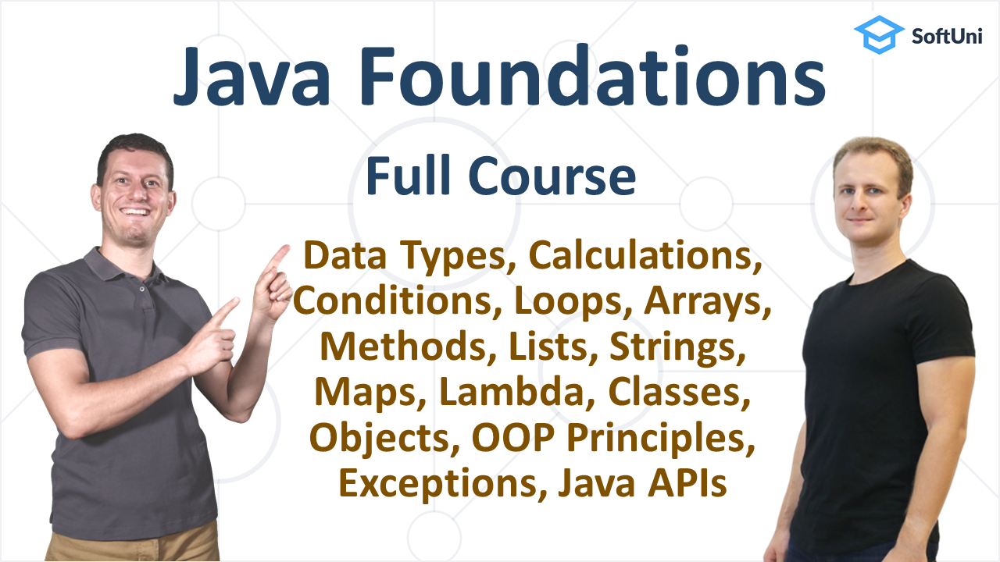

  

  <h3 align="center">Free Java Foundations Certification Course</h3>

### 📕 Info

This is the repository for Java Foundations Certification Course.

### Table Of Contents
📌 [Getting Started with Java](#-Getting-Started-with-Java) 
📌 [IntelliJ IDEA](#-IntelliJ-IDEA) 
📌 [Console-Based Input and Output](#-Console-Based-Input-and-Output) 
📌 [Data and Calculations](#-Data-and-Calculations) 
📌 [Conditional Statements](#-Conditional-Statements) 
📌 [For Loops](#-For-Loops) 
📌 [While Loops](#-While-Loops) 
📌 [Nested Loops](#-Nested-Loops) 
📌 [Arrays](#-Arrays) 
📌 [Methods](#-Methods) 
📌 [Lists](#-Lists) 
📌 [Strings and Text Processing](#-Strings-and-Text-Processing) 
📌 [Maps, Lambda and Stream API](#-Maps,-Lambda-and-Stream-API) 
📌 [Objects and Classes](#-Objects-and-Classes) 
📌 [Defining Classes](#-Defining-Classes) 
📌 [OOP Principles](#-OOP-Principles) 
📌 [Exception Handling](#-Exception-Handling) 
📌 [API Classes](#-API-Classes) 
📌 [JDK and JRE](#-JDK-and-JRE) 

## 💻 Getting Started with Java

This code lesson teaches the first steps in coding with Java: writing code commands, writing simple Java programs, compiling and running the code. It comes with practical exercises with automated grading.

| Resources | Link |
| ----- | :-----: |
| GitHub Chapter | [Getting Started with Java](https://github.com/SoftUni/Free-Java-Certification-Course/tree/main/01-Getting-Started-with-Java.md) |
| YouTube Video | [Getting Started with Java](https://youtu.be/sXM31yfsj04) |
| Article | [Getting Started with Java](https://softuni.org/code-lessons/java-basics-tutorial-part-1-getting-started-with-java/) |
| Lesson Slides | [Presentation](https://softuni.org/wp-content/plugins/pdf-viewer-for-elementor/assets/pdfjs/web/viewer.html?file=https://softuni.org/wp-content/uploads/2021/10/Java-Basics-Tutorial-Part-1-Getting-Started.pdf&embedded=true) |
| Exercises: Problem Description | [Presentation](https://softuni.org/wp-content/plugins/pdf-viewer-for-elementor/assets/pdfjs/web/viewer.html?file=https://softuni.org/wp-content/uploads/2021/10/Java-Basics-Tutorial-Part-1-Getting-Started-Exercises.pdf&embedded=true) |
| Test Exercises on the Judge System | [Judge System ](https://judge.softuni.org/Contests/3250/Java-Tutorial-Getting-Started-Part-1) |

## 💻 IntelliJ IDEA

Learn about development environments (IDE) and JDK and how to install and use IntelliJ IDEA to create Java projects, write Java code, and compile, run and debug Java projects. Practice your new skills with hands-on exercises with automated grading.

| Resources | Link |
| ----- | :-----: |
| GitHub Chapter ||
| YouTube Video | |
| Article | |
| Lesson Slides | |
| Exercises: Problem Description | |
| Test Exercises on the Judge System | |