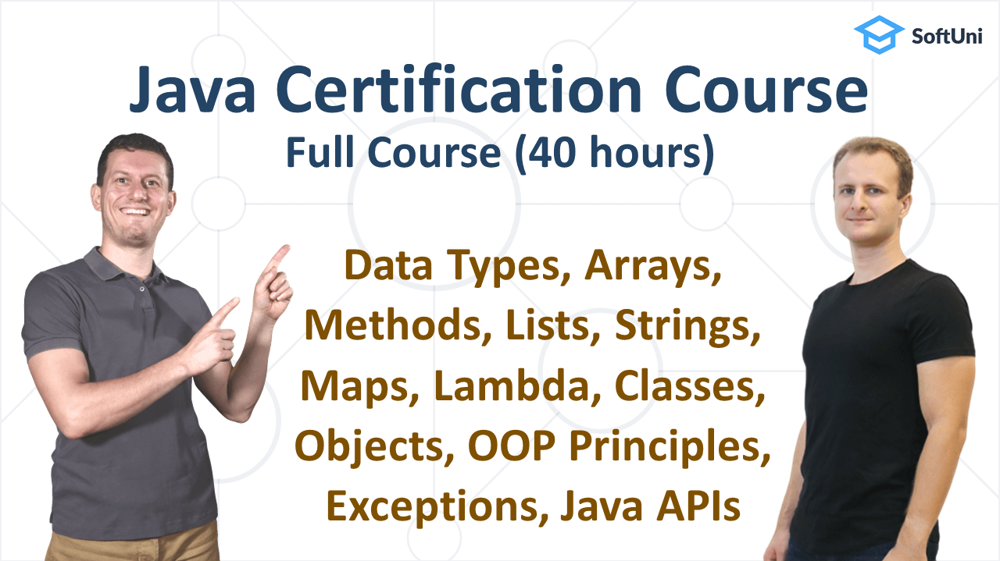

  <h1 align="center">Free Java Foundations Certification Course</h1>

  

#### 📕 Info

This is a free **Java Foundations Certification Course** from SoftUni Global. It includes **20 lessons**, **40-hours of video lessons** + **112 hands-on exercises**. To make it easier for you, we have separated each lesson into a different markdown file. You can see them inside the lessons folder on this GitHub repository.

#### Table Of Contents
📌 [0. About](#About) 
📌 [1. Getting Started with Java](#1-Getting-Started-with-Java) 
📌 [2. IntelliJ IDEA](#2-IntelliJ-IDEA) 
📌 [3. Console-Based Input and Output](#3-Console-Based-Input-and-Output) 
📌 [4. Data and Calculations](#4-Data-and-Calculations) 
📌 [5. Conditional Statements](#5-Conditional-Statements) 
📌 [6. Advanced Conditional Statements](#6-Advanced-Conditional-Statements) 
📌 [7. For Loops](#7-For-Loops) 
📌 [8. While Loops](#8-While-Loops) 
📌 [9 Nested Loops](#9-Nested-Loops) 
📌 [10. Arrays](#10-Arrays) 
📌 [11. Methods](#11-Methods) 
📌 [12. Lists](#12-Lists) 
📌 [13. Strings and Text Processing](#13-Strings-and-Text-Processing) 
📌 [14. Maps, Lambda and Stream API](#14-Maps,-Lambda-and-Stream-API) 
📌 [15. Objects and Classes](#15-Objects-and-Classes) 
📌 [16. Defining Classes](#16-Defining-Classes) 
📌 [17. OOP Principles](#17-OOP-Principles) 
📌 [18. Exception Handling](#18-Exception-Handling) 
📌 [19. API Classes](#19-API-Classes) 
📌 [20. JDK and JRE](#20-JDK-and-JRE) 

### About

Java is one of the most used programming languages. It's easy to learn, and you can run it on any machine. You can use Java for Web Development, Mobile Development, Automation, and much more.

This course will help you learn the core elements of programming with a practical, hands-on approach. We cover everything from the basics to the advanced features.

After finishing this course, you will be ready for the official exam from Oracle – Java Foundations 1Z0-811. It is version-independent and will be valid forever.

#### Who will lead this course?
| Image | Name | About |
| :-: | :-: | - |
|  | [Svetlin Nakov](https://www.linkedin.com/in/nakov/) | Svetlin Nakov is co-founder and the main inspirer of [SoftUni](https://softuni.org) - the leading institution for training software engineering, IT and digital skills in Bulgaria, attended by tens of thousands of young developers. Svetlin has solid professional experience (20+ years) as software developer and consultant, blockchain technologies, C#, .NET Framework, Java, Java EE, databases, JavaScript, Oracle, SQL Server, Web development, HTML, CSS, JSP/Servlets, GWT, PHP, Python, software engineering and project management. | 
|  | George Georgiev | George Georgiev is a senior software engineer with many years of experience with Java, JavaScript and C++. George enjoys teaching programming very much and is one of the top trainers at the Software University, having delivered over 300 technical training sessions on the topics of data structures and algorithms, Java essentials, Java fundamentals, C++ programming, C# development and many others. | 

#### Why take our Java Certification course?

🎯 It's 100% FREE. 
🎯 It will prepare you for the official Oracle Java Foundations exam(Exam Number: 1Z0-811). 
🎯 It's led by professionals with many years of experience. 
🎯 It includes many in-depth explanations and practical exercises for your guaranteed success on the exam. 

<h2 align="center">Java Foundations Certification Lessons</h2>

### 1. Getting Started with Java

This code lesson teaches the first steps in coding with Java: writing code commands, writing simple Java programs, compiling and running the code. It comes with practical exercises with automated grading.

| GitHub Chapter Name | Link |
| :- | - |
| 01-Getting-Started-with-Java.md | [To Lesson](https://github.com/SoftUni/Free-Java-Certification-Course/tree/main/lessons/01-Getting-Started-with-Java.md) |

### 2. IntelliJ IDEA

Learn about development environments (IDE) and JDK and how to install and use IntelliJ IDEA to create Java projects, write Java code, and compile, run and debug Java projects. Practice your new skills with hands-on exercises with automated grading.

| GitHub Chapter Name | Link |
| :- | - |
| 02-InteliJ-IDEA.md | [To Lesson](https://github.com/SoftUni/Free-Java-Certification-Course/tree/main/lessons/02-InteliJ-IDEA.md) |

### 3. Console-Based Input and Output

Learn how to process console input and output in Java, how to read text and numbers and how to print formatted text, integers and floating-point numbers on the console. Solve several practical problems and submit them for automated grading in the SoftUni Judge.

| GitHub Chapter Name | Link |
| :- | - |
| 03-Console-Based-Input-and-Output.md | [To Lesson](https://github.com/SoftUni/Free-Java-Certification-Course/tree/main/01-Getting-Started-with-Java.md) |

### 4. Data and Calculations

Learn how to use variables, data types, expressions and statements to perform simple calculations in Java. Practice your new skills with the hands-on exercises, coming with this code lesson. Get an automated evaluation for your code in the SoftUni judge.

| GitHub Chapter Name | Link |
| :- | - |
| 04-Data-and-Calculations.md | [To Lesson](https://github.com/SoftUni/Free-Java-Certification-Course/tree/main/01-Getting-Started-with-Java.md) |

### 5. Conditional Statements

Learn how to use logical expressions, conditional statements, code debugging, and breaking. Practice your new skills with the hands-on exercises coming with this code lesson. Get an automated evaluation for your code in the SoftUni judge.

| GitHub Chapter Name | Link |
| :- | - |
| 05-Conditional-Statements.md | [To Lesson](https://github.com/SoftUni/Free-Java-Certification-Course/tree/main/01-Getting-Started-with-Java.md) |

### 6. Advanced Conditional Statements

Learn how to work with the nested condition, switch case, and multi-label switch-case. Practice your new skills with the hands-on exercises coming with this code lesson. Get an automated evaluation for your code in the SoftUni judge.

| GitHub Chapter Name | Link |
| :- | - |
| 06-Advanced-Conditional-Statements.md | [To Lesson](https://github.com/SoftUni/Free-Java-Certification-Course/tree/main/01-Getting-Started-with-Java.md) |

### 7. For Loops

Learn how to work with the nested condition, switch case, and multi-label switch-case. Practice your new skills with the hands-on exercises coming with this code lesson. Get an automated evaluation for your code in the SoftUni judge.

| GitHub Chapter Name | Link |
| :- | - |
| 07-For-Loops.md | [To Lesson](https://github.com/SoftUni/Free-Java-Certification-Course/tree/main/01-Getting-Started-with-Java.md) |

### 8. While Loops

In programming, a loop is used to repeat a block of code until a specified condition is met. The for loop is best when you want to do something for a fixed number of times.

| GitHub Chapter Name | Link |
| :- | - |
| 08-While-Loops.md | [To Lesson](https://github.com/SoftUni/Free-Java-Certification-Course/tree/main/01-Getting-Started-with-Java.md) |

### 9. Nested Loops

In programming, a loop is used to repeat a block of code until a specified condition is met. The while loop controls flow statement that allows code to be executed repeatedly based on a given boolean condition.

| GitHub Chapter Name | Link |
| :- | - |
| 09-Nested-Loops.md | [To Lesson](https://github.com/SoftUni/Free-Java-Certification-Course/tree/main/01-Getting-Started-with-Java.md) |

### 10. Arrays

Build a strong foundation of knowledge in Java programming! In this lesson, we take a look at arrays and how to use them! We shall learn how to define and initialize and array, to to access its elements, how to read and print arrays, and basic array algorithms.

| GitHub Chapter Name | Link |
| :- | - |
| 10-Arrays.md | [To Lesson](https://github.com/SoftUni/Free-Java-Certification-Course/tree/main/01-Getting-Started-with-Java.md) |

### 11. Methods

In this lesson, we will review another very important paradigm in the programming universe – methods. We will find a few ways in which will make our code more organized and readable. Also, we are going to learn how to extend the functionality of our code. We shall learn how to define and invoke methods and how to use parameters and return a value.

| GitHub Chapter Name | Link |
| :- | - |
| 11-Methods.md | [To Lesson](https://github.com/SoftUni/Free-Java-Certification-Course/tree/main/01-Getting-Started-with-Java.md) |

### 12. Lists

Lists are one of the most popular data structures in programming, as they allow for flexibility. Unlike arrays, their length is not fixed and you can insert and delete elements at any point. In this lesson, we shall learn how to use lists in Java, how to define and initialize list, how to access its elements, how to add, edit, delete and insert elements, how to read, print and traverse lists.

| GitHub Chapter Name | Link |
| :- | - |
| 12-Lists.md | [To Lesson](https://github.com/SoftUni/Free-Java-Certification-Course/tree/main/01-Getting-Started-with-Java.md) |

### 13. Strings and Text Processing

Learn about strings and text processing in Java, how to read and print strings, how to search in a string, how to extract a substring, how to remove a substring and how to build a string.

| GitHub Chapter Name | Link |
| :- | - |
| 13-Strings-and-Text-Processing.md | [To Lesson](https://github.com/SoftUni/Free-Java-Certification-Course/tree/main/01-Getting-Started-with-Java.md) |

### 14. Maps, Lambda and Stream API

Build a strong foundation of knowledge in Java programming! In this lesson, we take a look at maps, lambda expressions, and the stream API in Java. We shall learn how to map keys to values, how to process sequences of elements (streams) and how to filter, transform, sort and aggregate the elements.

| GitHub Chapter Name | Link |
| :- | - |
| 14-Maps,-Lambda-and-Stream-API.md | [To Lesson](https://github.com/SoftUni/Free-Java-Certification-Course/tree/main/01-Getting-Started-with-Java.md) |

### 15. Objects and Classes

This lesson provides a great overview of objects and classes if you are a beginner on the topic. With it, you will make your first steps in the world of Object-Oriented Programming (OOP), which is one of the most widely-used programming paradigms in modern programming. 

By the end of the lesson, you will be familiar with the objects and class work and their purpose. You will also know the different parts of a class – methods, constructors, getters and setters, fields, etc.

| GitHub Chapter Name | Link |
| :- | - |
| Objects and Classes | [To Lesson](https://github.com/SoftUni/Free-Java-Certification-Course/tree/main/01-Getting-Started-with-Java.md) |

### 16. Defining Classes

You will go over the topics of defining simple classes, conventions, and best practices in doing so, creating objects of these classes, object references, and what is the difference between an object and a class. 

| GitHub Chapter Name | Link |
| :- | - |
| Defining Classes | [To Lesson](https://github.com/SoftUni/Free-Java-Certification-Course/tree/main/01-Getting-Started-with-Java.md) |

### 17. OOP Principles

Learn the four pillars of Object-Oriented Programming (OOP): encapsulation, abstraction, inheritance and polymorphism. Learn how to define classes with properties, how to define and use interfaces in Java, how to inherit classes and how invoke abstract actions using polymorphism.

| GitHub Chapter Name | Link |
| :- | - |
| OOP Principles | [To Lesson](https://github.com/SoftUni/Free-Java-Certification-Course/tree/main/01-Getting-Started-with-Java.md) |

### 18. Exception Handling

Learn about exception handling in Java: how to throw and catch exceptions, the exception class hierarchy, the compile-time and runtime exceptions and others.

| GitHub Chapter Name | Link |
| :- | - |
| Exception Handling | [To Lesson](https://github.com/SoftUni/Free-Java-Certification-Course/tree/main/01-Getting-Started-with-Java.md) |

### 19. API Classes

In the current lesson, we take a closer look at the most frequently used Java API classes. Get familiar with the Math class, how to generate random numbers, the need for BigInteger and BigDecimal in programming, and how to work with date and time in Java. We will also look at two of the main Java classes – Arrays and Formatter.

| GitHub Chapter Name | Link |
| :- | - |
| API Classes | [To Lesson](https://github.com/SoftUni/Free-Java-Certification-Course/tree/main/01-Getting-Started-with-Java.md) |

### 20. JDK and JRE

You will go over the topics of JDK, JRE, and command-line Java tools. You will learn how to compile and run a Java program through console commands, the concept of classpath, JAR archives and Java modules.

| GitHub Chapter Name | Link |
| :- | - |
| JDK and JRE | [To Lesson](https://github.com/SoftUni/Free-Java-Certification-Course/tree/main/01-Getting-Started-with-Java.md) |
