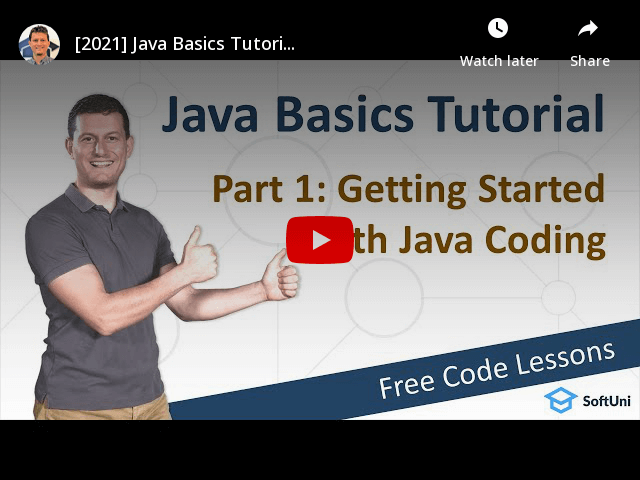

<h1 align="center">1. Getting Started with Java</h1>

#### 1. Lesson Summary
In this lesson, Svetlin Nakov explains what **coding** is, what **commands** are and what is their syntax in Java. He teaches how to write simple **Java commands** and **Java programs**, and how to **run the Java code** and see the execution results.

Together we will solve a few **coding exercises** to practice the new skills from this lesson. We shall use a **free online code editor** called **repl.it**, so you need nothing more than your laptop. It is recommended to **use a laptop** instead of a tablet or smartphone, because it works better.

Finally, the instructor shows you how to use the **SoftUni Judge**, our automated code evaluation system and how to submit your code for automated grading.

#### 2. Table of Contents
* [1. Lesson Summary](#1-Lesson-Summary)
* [2. Table of Content](#2-Table-of-Content)
* [3. YouTube Video](#3-YouTube-Video)
* [4. Lesson Topics](#4-Lesson-Topics)
* [5. Resources](#5-Resources)
* [6. Practical Exercises](#6-Practical-Exercises)
* [7. GitHub Repository Navigation](#7-GitHub-Repository-Navigation)

#### 3. Lesson Video

#### 4. Lesson Topics
In this lesson we cover the following topics:
* What is coding and how to write code in Java?
* Online coding environments and how to use repl.it to write Java code.
* Writing commands in Java
* Coding concepts
  * Programming
  * Commands
  * Code
  * Algorithms
  * IDEs

#### 5. Resources

Remember that coding is a skill, which should be practiced. To learn to code, you should write code every day for a long time. Watching tutorials is not enough. You should code! 

| Resources | Link |
| ----- | ----- |
| Lesson Video| [YouTube](https://youtu.be/sXM31yfsj04) |
| Lesson Content | [SoftUni](https://softuni.org/code-lessons/java-basics-tutorial-part-1-getting-started-with-java/) |

#### 6. Practical Exercises

 <a href="https://softuni.org/checkout/join-community">Register</a> now and take your free resources right away! You will get access to **automated exercises** which will sharpen your coding skills. Become a member of the SoftUni Global Community and communicate with other students and mentors and get help for **FREE**. 
 

Please watch the video and solve the exercise problems. Writing code is the only way to master the skill of coding. Submit your code at the SoftUni Judge.

| Resources | Link |
| ----- | ----- |
| Problem Descriptions | [Available after Free Registration](https://softuni.org/code-lessons/java-basics-tutorial-part-1-getting-started-with-java/) |
| Submit Solutions for Evaluation | [Available after Free Registration](https://softuni.org/code-lessons/java-basics-tutorial-part-1-getting-started-with-java/) |

#### 7. Navigation

    « Previous Lesson &nbsp; | &nbsp; <a href="https://github.com/SoftUni/Free-Java-Certification-Course">Home</a> &nbsp; | &nbsp; <a href="https://github.com/SoftUni/Free-Java-Certification-Course/tree/main/lessons/02-InteliJ-IDEA.md">Next Lesson »</a>

