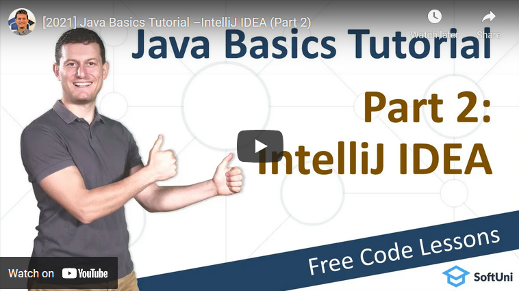

<h1 align="center">2. IntelliJ IDEA</h1>

#### 1. Summary

In this lesson, Svetlin Nakov talks about development environments (IDEs), which are used by developers to **write**, **compile**, **run** and **debug code**. He will teach you how to use **IntelliJ IDEA**, the most popular **IDE** for Java developers. He will show you how to install **JDK** (Java development kit), how to install and run **IntelliJ IDEA**, how to create a console-based app, how to write code, how to use the auto-complete to speed up coding, how to run your programs and even how to debug your code. In the video Nakov will show you how to create new **Java** project, choose the project type, give a name for the project, create a class with a **“main”** method, write some code in it, and finally, run the project.

#### 2. Table of Content
* [1. Summary](#1-Summary)
* [2. Table of Content](#2-Table-of-Content)
* [3. YouTube Video](#3-YouTube-Video)
* [4. Lesson Topics](#4-Lesson-Topics)
* [5. Resources](#5-Resources)
* [6. Practical Exercises](#6-Practical-Exercises)
* [7. Navigation](#7-Navigation)

#### 3. YouTube Video

#### 4. Lesson Topics

In this tutorial we cover the following topics:
* Integrated Development Environments
* What is IntelliJ IDEA?
* Installing InteliJ IDEA Community
* Running IntelliJ IDEA
* Projects in IntelliJ IDEA
* Creating a Console App
* Configuring JDK in IntelliJ IDEA
* Coding Exercises

#### 5. Resources

Remember that coding is a skill, which should be practiced. To learn to code, you should write code every day for a long time. Watching tutorials is not enough. You should code! 

| Resources | Link |
| -| :-: |
| Lesson Video | [Youtube](https://youtu.be/3Hny8Mz2agQ) |
| Lesson Content | [SoftUni ](https://softuni.org/code-lessons/java-basics-tutorial-part-2-intellij-idea) |

#### 6. Practical Exercises
<a href="https://softuni.org/checkout/join-community">Register</a> now and take your free resources right away! You will get access to **automated exercises** which will sharpen your coding skills. Become a member of the SoftUni Global Community and communicate with other students and mentors and get help for **FREE**.
Please watch the video and solve the exercise problems. Writing code is the only way to master the skill of coding. Submit your code at the SoftUni Judge.

| Resources | Link |
| - | :-: |
|  Problem Descriptions | [Available after Free Registration](https://softuni.org/code-lessons/java-basics-tutorial-part-2-intellij-idea) |
| Submit Solutions for Evaluation | [Available after Free Registration](https://softuni.org/code-lessons/java-basics-tutorial-part-2-intellij-idea) |

#### 7. Navigation

    <a href="https://github.com/SoftUni/Free-Java-Certification-Course/blob/main/lessons/01-Getting-Started-with-Java.md">« Previous Lesson</a> &nbsp; | &nbsp; <a href="https://github.com/SoftUni/Free-Java-Certification-Course">Home</a> &nbsp; | &nbsp; <a href="https://github.com/SoftUni/Free-Java-Certification-Course/tree/main/lessons/02-InteliJ-IDEA.md">Next Lesson »</a>

