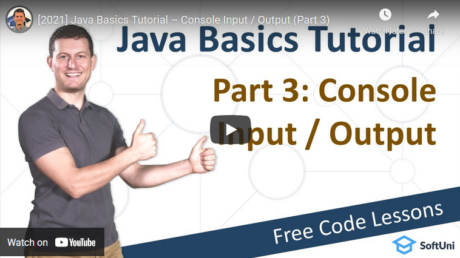

<h1 align="center">3. Console-Based Input and Output</h1>

#### 1. Lesson Summary
In this lesson, Svetlin Nakov teaches how to read and work with console-based **input** and **output**. Learn how to read strings and numbers from the standard input and how to format and print text, numbers and other data to the standard output.

The console is the **terminal** window that is running the Java program. I.e., that's the terminal window where you type in the command java **ProgramName**. When a Java program starts running, the **Java runtime system** will initialize many variables in support of the running program.

Svetlin Nakov demonstrates several ways to use a **console** for user **input** and **output** in **Java**. Learn how to use the **console API** in **Java**: **java.util.Scanner, System.out, System.out.print(), System.out.print()** and **System.out.printf()** with placeholders.

#### 2. Table of Contents
* [1. Lesson Summary](#1-Lesson-Summary)
* [2. Table of Content](#2-Table-of-Content)
* [3. YouTube Video](#3-YouTube-Video)
* [4. Lesson Topics](#4-Lesson-Topics)
* [5. Resources](#5-Resources)
* [6. Practical Exercises](#6-Practical-Exercises)
* [7. Navigation](#7-Navigation)

#### 3. Lesson Video

#### 4. Lesson Topics
In this lesson we cover the following topics:
* What is the Console?
* Reading User Input and Printing Strings
  * Reading Integers
  * Reading Floating-Point Numbers
  * Concatenating Text and Numbers
* Coding Exercises

#### 5. Resources

Remember that coding is a skill, which should be practiced. To learn to code, you should write code every day for a long time. Watching tutorials is not enough. You should code! 

| Resources | Link |
| ----- | ----- |
| Lesson Video| [YouTube](https://youtu.be/JcT7eh_X_sM) |
| Lesson Content | [SoftUni](https://softuni.org/code-lessons/java-basics-tutorial-part-3-input-and-output/) |

#### 6. Practical Exercises
You will get access to **automated exercises** which will sharpen your coding skills. Become a member of the SoftUni Global Community and communicate with other students and mentors and get help for **FREE**.
Please watch the video and solve the exercise problems. Writing code is the only way to master the skill of coding. Submit your code at the SoftUni Judge.

| Resources | Link |
| ----- | ----- |
| Problem Descriptions | [Access the Learning Materials](https://softuni.org/code-lessons/java-basics-tutorial-part-3-input-and-output/) |
| Submit Solutions for Evaluation | [Access the Learning Materials](https://softuni.org/code-lessons/java-basics-tutorial-part-3-input-and-output/) |

#### 7. Navigation

    <a href="https://github.com/SoftUni/Free-Java-Certification-Course/tree/main/lessons/02-InteliJ-IDEA.md">« Previous Lesson</a> &nbsp; | &nbsp; <a href="https://github.com/SoftUni/Free-Java-Certification-Course">Home</a> &nbsp; | &nbsp; <a href="https://github.com/SoftUni/Free-Java-Certification-Course/blob/main/lessons/04-Data-and-Calculations.md">Next Lesson »</a>

