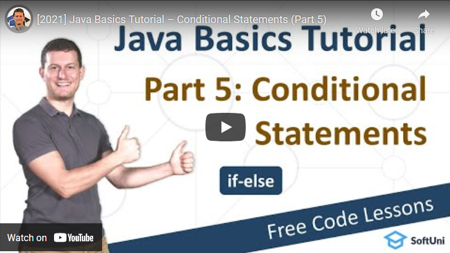

<h1 align="center">5. Conditional Statements</h1>

#### 1. Lesson Summary
In this lesson, we continue with the Java Basics Tutorial. A<strong> conditional statement</strong> is a piece of code that checks the given <strong>condition</strong>, and when it is <strong>true</strong>, the code related to it is performed. It is used to make decisions based on the <strong>conditions</strong>. <strong>Conditional statements</strong> execute when there is <strong>no condition</strong> around the statements. If you put a <strong>condition</strong> for a block of statements, the execution flow may change based on the result evaluated by the <strong>condition</strong>. This process is called <strong>decision-making</strong>.

<strong>Conditional statements</strong> begin with the keyword <strong>if</strong> followed by parentheses. An expression is placed inside the parentheses, then evaluated when the<strong> conditional statement</strong> is reached. 

The parentheses are followed by a block, which is defined inside opening <strong>{</strong> and closing<strong> }</strong> curly brackets. The source code inside the block executes if the expression inside the parentheses evaluates to <strong>true</strong>. If the expression in the <strong>conditional statement</strong> evaluates to <strong>true</strong>, the execution of the program progresses to the block defined by the <strong>conditional statement</strong>.

On the other hand, if the expression evaluates to <strong>false</strong>, the execution moves on to the statement after the closing curly bracket of the current <strong>conditional statement</strong>. Using the <strong>else</strong> command, we create an alternative option for when the <strong>conditional expression</strong> evaluates to <strong>false</strong>. In the case of multiple <strong>conditions</strong>, we can use the<strong> else if </strong> command. <strong>else if</strong> is like <strong>else</strong>, but with an additional <strong>condition</strong>. It follows the <strong>if-condition</strong>, and they may be multiple.

To sum it up,<strong> conditional statements</strong> are something that you must learn if you want to continue developing as a programmer. They s are specified by a set of statements having boolean expressions which, are evaluated to a boolean value <strong>true</strong> or <strong>false</strong>. <strong>Conditional statements</strong> help us to make a decision based on certain <strong>conditions</strong>.

#### 2. Table of Contents
* [1. Lesson Summary](#1-Lesson-Summary)
* [2. Table of Content](#2-Table-of-Content)
* [3. YouTube Video](#3-YouTube-Video)
* [4. Lesson Topics](#4-Lesson-Topics)
* [5. Resources](#5-Resources)
* [6. Practical Exercises](#6-Practical-Exercises)
* [7. Navigation](#7-Navigation)

#### 3. Lesson Video

#### 4. Lesson Topics
* In this lesson we cover the following topics:
* Logical Expressions
* Conditional Statements
* Series of Checks
* Variable Scope
* Debugging
* Coding Exercises

#### 5. Resources

Remember that coding is a skill, which should be practiced. To learn to code, you should write code every day for a long time. Watching tutorials is not enough. You should code! 

| Resources | Link |
| ----- | ----- |
| Lesson Video| [YouTube](https://youtu.be/7H3K4g8BQ3w) |
| Lesson Content | [SoftUni](https://softuni.org/code-lessons/java-basics-tutorial-part-5-conditional-statements/) |

#### 6. Practical Exercises
You will get access to **automated exercises** which will sharpen your coding skills. Become a member of the SoftUni Global Community and communicate with other students and mentors and get help for **FREE**.
Please watch the video and solve the exercise problems. Writing code is the only way to master the skill of coding. Submit your code at the SoftUni Judge.

| Resources | Link |
| ----- | ----- |
| Problem Descriptions | [Access the Learning Materials](https://softuni.org/code-lessons/java-basics-tutorial-part-5-conditional-statements/) |
| Submit Solutions for Evaluation | [Access the Learning Materials](https://softuni.org/code-lessons/java-basics-tutorial-part-5-conditional-statements/) |

#### 7. Navigation

    <a href="https://github.com/SoftUni/Free-Java-Certification-Course/blob/main/lessons/04-Data-and-Calculations.md">« Previous Lesson</a> &nbsp; | &nbsp; <a href="https://github.com/SoftUni/Free-Java-Certification-Course">Home</a> &nbsp; | &nbsp; <a href="https://github.com/SoftUni/Free-Java-Certification-Course/blob/main/lessons/06-Advanced-Conditional-Statements.md">Next Lesson »</a>

