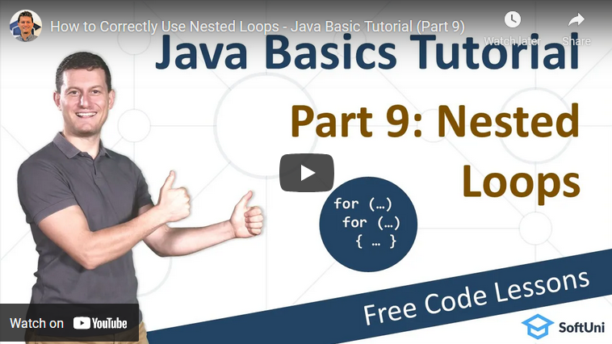

<h1 align="center">9. Nested Loops</h1>

#### 1. Lesson Summary

A nested loop is the placement of a loop inside another loop to execute the operations that need multiple loop traversals, such as printing star patterns. Although it helps to make our task easier, it also increases the complexity of the program thus must be used efficiently.

In this lesson, we continue with the <strong>Java Basics Tutorial</strong>. Now, onto the important part: if a loop exists inside the body of another loop, it is called a <b>nested loop</b>. It has no <b>limitations</b> that only similar types of loops can be nested. 

We can <b>nest </b>any loop inside any other loop, such as <b>while loop</b> inside<b> for loop,</b> and all different combinations are accepted.

First, when we enter the body of the program, a statement such as <strong>initialization</strong> gets executed. Once a loop is found, the program checks for the <strong>condition</strong> for the outer loop, and if it returns <strong>true</strong>, it enters the loop. Once it enters the outer loop and encounters the inner loop, variables are <strong>initialized</strong> if any are present. Then it checks the <strong>condition</strong> for the inner loop, and if it returns <strong>true</strong>, the program enters into the inner loop. This procedure is repeated several times, and then the program exits from the second loop, then the first loop, and move to statements present after the loop.

#### 2. Table of Contents
* [1. Lesson Summary](#1-Lesson-Summary)
* [2. Table of Content](#2-Table-of-Content)
* [3. YouTube Video](#3-YouTube-Video)
* [4. Lesson Topics](#4-Lesson-Topics)
* [5. Resources](#5-Resources)
* [6. Practical Exercises](#6-Practical-Exercises)
* [7. Navigation](#7-Navigation)

#### 3. Lesson Video

#### 4. Lesson Topics
* In this lesson we cover the following topics:
* Complex Loops
* Nested Loops
* Nested For-Loops
* Nested While Loops
* Nesting While and For Loops
* Coding Exercises

#### 5. Resources

Remember that coding is a skill, which should be practiced. To learn to code, you should write code every day for a long time. Watching tutorials is not enough. You should code! 

| Resources | Link |
| ----- | ----- |
| Lesson Video| [YouTube](https://youtu.be/FU90zeFZZFs) |
| Lesson Content | [SoftUni](https://softuni.org/code-lessons/what-are-nested-loops-java-basics-part-9/) |

#### 6. Practical Exercises
<a href="https://softuni.org/checkout/join-community">Register</a> now and take your free resources right away! You will get access to **automated exercises** which will sharpen your coding skills. Become a member of the SoftUni Global Community and communicate with other students and mentors and get help for **FREE**.
Please watch the video and solve the exercise problems. Writing code is the only way to master the skill of coding. Submit your code at the SoftUni Judge.

| Resources | Link |
| ----- | ----- |
| Problem Descriptions | [Available after Free Registration](https://softuni.org/code-lessons/what-are-nested-loops-java-basics-part-9/) |
| Submit Solutions for Evaluation | [Available after Free Registration](https://softuni.org/code-lessons/what-are-nested-loops-java-basics-part-9/) |

#### 7. Navigation

    <a href="https://github.com/SoftUni/Free-Java-Certification-Course/blob/main/lessons/08-While-Loops.md">« Previous Lesson</a> &nbsp; | &nbsp; <a href="https://github.com/SoftUni/Free-Java-Certification-Course">Home</a> &nbsp; | &nbsp; <a href="https://github.com/SoftUni/Free-Java-Certification-Course/blob/main/lessons/10-Arrays.md">Next Lesson »</a>

