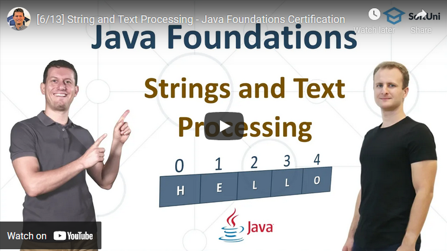

<h1 align="center">13. Strings and Text Processing</h1>

#### 1. Lesson Summary

This lesson introduces **strings** and provides an in-depth explanation of **text processing** in **Java**. It includes several very important topics surrounding **strings** – the **StringBuilder class**, **concatenation** and why it’s a slow operation, the methods **concat()**, **indexOf()**, **contains()**, **split()**, **replace()**, and many more. 

#### 2. Table of Contents
* [1. Lesson Summary](#1-Lesson-Summary)
* [2. Table of Content](#2-Table-of-Content)
* [3. YouTube Video](#3-YouTube-Video)
* [4. Lesson Topics](#4-Lesson-Topics)
* [5. Resources](#5-Resources)
* [6. Practical Exercises](#6-Practical-Exercises)
* [7. Navigation](#7-Navigation)

#### 3. Lesson Video

#### 4. Lesson Topics
In this lesson we cover the following topics:
* What is coding and how to write code in Java?
* Online coding environments and how to use repl.it to write Java code.
* Writing commands in Java
* Coding concepts
  * Programming
  * Commands
  * Code
  * Algorithms
  * IDEs
* Coding Exercises

#### 5. Resources

Remember that coding is a skill, which should be practiced. To learn to code, you should write code every day for a long time. Watching tutorials is not enough. You should code! 

| Resources | Link |
| ----- | ----- |
| Lesson Video| [YouTube](https://youtu.be/uTXLkIG1UCE) |
| Lesson Content | [SoftUni](https://softuni.org/code-lessons/java-foundations-certification-strings-and-text-processing/) |

#### 6. Practical Exercises
You will get access to **automated exercises** which will sharpen your coding skills. Become a member of the SoftUni Global Community and communicate with other students and mentors and get help for **FREE**.
Please watch the video and solve the exercise problems. Writing code is the only way to master the skill of coding. Submit your code at the SoftUni Judge.

| Resources | Link |
| ----- | ----- |
| Problem Descriptions | [Access the Learning Materials](https://softuni.org/code-lessons/java-foundations-certification-strings-and-text-processing/) |
| Submit Solutions for Evaluation | [Access the Learning Materials](https://softuni.org/code-lessons/java-foundations-certification-strings-and-text-processing/) |

#### 7. Navigation

    <a href="https://github.com/SoftUni/Free-Java-Certification-Course/blob/main/lessons/12-Lists.md">« Previous Lesson</a> &nbsp; | &nbsp; <a href="https://github.com/SoftUni/Free-Java-Certification-Course">Home</a> &nbsp; | &nbsp; <a href="https://github.com/SoftUni/Free-Java-Certification-Course/blob/main/lessons/14-Maps%2C-Lambda-and-Stream-API.md">Next Lesson »</a>

