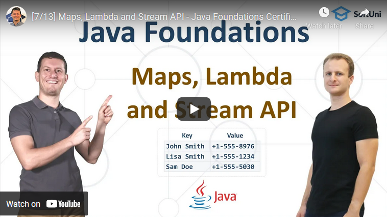

<h1 align="center">14. Maps, Lambda and Stream API</h1>

#### 1. Lesson Summary

In this video we go in depth explaining <b>maps, lambda and the stream API</b>. All of these three topics are <b>extremely important</b> for every beginner programmer to learn as they are part of the pillars of programming, just like the rest of the topics in the current course.
By the end of the lesson, you will be familiar with three different types of maps in Java - <b>the HashMap, the LinkedHashMap and the TreeMap</b>. All have their special traits and serve a specific purpose, which George explains very well.
Then you will dive deep into <b>lambda expressions</b> and see how important they are when we are doing certain operations with maps.
Finally, George will touch up on another <b>important topic when it comes to maps</b> - <b>the Stream API</b>, which provides many <b>methods for easy querying </b>of a collection.

#### 2. Table of Contents
* [1. Lesson Summary](#1-Lesson-Summary)
* [2. Table of Content](#2-Table-of-Content)
* [3. YouTube Video](#3-YouTube-Video)
* [4. Lesson Topics](#4-Lesson-Topics)
* [5. Resources](#5-Resources)
* [6. Practical Exercises](#6-Practical-Exercises)
* [7. Navigation](#7-Navigation)

#### 3. Lesson Video

#### 4. Lesson Topics
In this lesson we cover the following topics:
* Associative Arrays (Maps)
    * HashMap <key, value>
    * LinkedHashMap <key, value>
    * TreeMap <key, value>
* Lambda Expressions
* Java Stream API
    * Filtering
    * Mapping
    * Ordering
* Coding Exercises

#### 5. Resources

Remember that coding is a skill, which should be practiced. To learn to code, you should write code every day for a long time. Watching tutorials is not enough. You should code! 

| Resources | Link |
| ----- | ----- |
| Lesson Video| [YouTube](https://youtu.be/FMUIhcJLJEM) |
| Lesson Content | [SoftUni](https://softuni.org/code-lessons/java-foundations-certification-maps-lambda-and-stream-api/) |

#### 6. Practical Exercises
<a href="https://softuni.org/checkout/join-community">Register</a> now and take your free resources right away! You will get access to **automated exercises** which will sharpen your coding skills. Become a member of the SoftUni Global Community and communicate with other students and mentors and get help for **FREE**.
Please watch the video and solve the exercise problems. Writing code is the only way to master the skill of coding. Submit your code at the SoftUni Judge.

| Resources | Link |
| ----- | ----- |
| Problem Descriptions | [Available after Free Registration](https://softuni.org/code-lessons/java-foundations-certification-maps-lambda-and-stream-api/) |
| Submit Solutions for Evaluation | [Available after Free Registration](https://softuni.org/code-lessons/java-foundations-certification-maps-lambda-and-stream-api/) |

#### 7. Navigation

    <a href="https://github.com/SoftUni/Free-Java-Certification-Course/blob/main/lessons/13-Strings-and-Text-Processing.md">« Previous Lesson</a> &nbsp; | &nbsp; <a href="https://github.com/SoftUni/Free-Java-Certification-Course">Home</a> &nbsp; | &nbsp; <a href="https://github.com/SoftUni/Free-Java-Certification-Course/blob/main/lessons/15-Objects-and-Classes.md">Next Lesson »</a>

