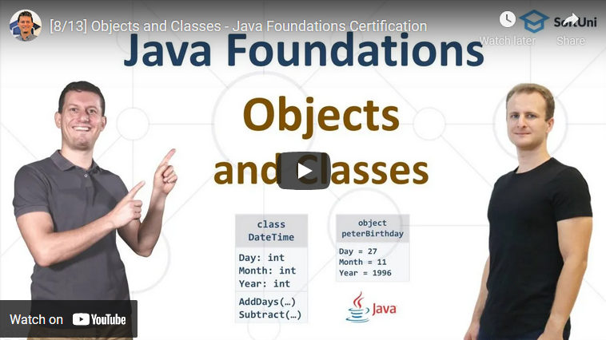

<h1 align="center">15. Objects and Classes</h1>

#### 1. Lesson Summary

The current lesson provides a great <b>overview of objects and classes</b> if you are a beginner on the topic. With it, you will make your first steps in the world of <b>Object-Oriented Programming (OOP)</b>, which is one of the <b>most widely-used programming paradigms</b> in modern programming.

By the end of the lesson, you will be familiar with the <b>objects and classes </b>work and their purpose. You will also know the different <b>parts of a class </b>- <b>methods, constructors, getters and setters, fields</b>, etc.

#### 2. Table of Contents
* [1. Lesson Summary](#1-Lesson-Summary)
* [2. Table of Content](#2-Table-of-Content)
* [3. YouTube Video](#3-YouTube-Video)
* [4. Lesson Topics](#4-Lesson-Topics)
* [5. Resources](#5-Resources)
* [6. Practical Exercises](#6-Practical-Exercises)
* [7. Navigation](#7-Navigation)

#### 3. Lesson Video

#### 4. Lesson Topics
In this lesson we cover the following topics:
* Objects
* Classes
* Built-In Classes
* Defining Simple Classes
    * Fields
    * Constructors
    * Methods
* Coding Exercises

#### 5. Resources

Remember that coding is a skill, which should be practiced. To learn to code, you should write code every day for a long time. Watching tutorials is not enough. You should code! 

| Resources | Link |
| ----- | ----- |
| Lesson Video| [YouTube](https://youtu.be/WIe4xOk0Qhk) |
| Lesson Content | [SoftUni](https://softuni.org/code-lessons/java-foundations-certification-objects-and-classes/) |

#### 6. Practical Exercises
<a href="https://softuni.org/checkout/join-community">Register</a> now and take your free resources right away! You will get access to **automated exercises** which will sharpen your coding skills. Become a member of the SoftUni Global Community and communicate with other students and mentors and get help for **FREE**.
Please watch the video and solve the exercise problems. Writing code is the only way to master the skill of coding. Submit your code at the SoftUni Judge.

| Resources | Link |
| ----- | ----- |
| Problem Descriptions | [Available after Free Registration](https://softuni.org/code-lessons/java-foundations-certification-objects-and-classes/) |
| Submit Solutions for Evaluation | [Available after Free Registration](https://softuni.org/code-lessons/java-foundations-certification-objects-and-classes/) |

#### 7. Navigation

    <a href="https://github.com/SoftUni/Free-Java-Certification-Course/blob/main/lessons/14-Maps%2C-Lambda-and-Stream-API.md">« Previous Lesson</a> &nbsp; | &nbsp; <a href="https://github.com/SoftUni/Free-Java-Certification-Course">Home</a> &nbsp; | &nbsp; <a href="https://github.com/SoftUni/Free-Java-Certification-Course/blob/main/lessons/16-Defining-Classes.md">Next Lesson »</a>

