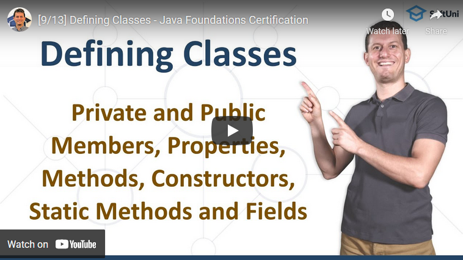

<h1 align="center">16. Defining Classes</h1>

In the current lesson, you will learn the foundations of <b>Object-Oriented Programming (OOP)</b>.

Svetlin Nakov will go over the topics of <b>defining simple classes</b>, <b>conventions, </b>and <b>best practices</b> in doing so, <b>creating objects</b> of these classes, <b>object references</b>, and what is <b>the difference between an object and a class</b>.

Later on in the lesson, you will become familiar with <b>data fields</b> and <b>access modifiers</b>, and of course - <b>constructors, getters, and setters</b>, which are <b>the building blocks of every class</b>. By the end of the lesson, you will also have a good understanding of the term <b>static</b>, which you've surely encountered multiple times so far.

#### 2. Table of Contents
* [1. Lesson Summary](#1-Lesson-Summary)
* [2. Table of Content](#2-Table-of-Content)
* [3. YouTube Video](#3-YouTube-Video)
* [4. Lesson Topics](#4-Lesson-Topics)
* [5. Resources](#5-Resources)
* [6. Practical Exercises](#6-Practical-Exercises)
* [7. Navigation](#7-Navigation)

#### 3. Lesson Video

#### 4. Lesson Topics
In this lesson we cover the following topics:
* What is coding and how to write code in Java?
* Online coding environments and how to use repl.it to write Java code.
* Writing commands in Java
* Coding concepts
  * Programming
  * Commands
  * Code
  * Algorithms
  * IDEs
* Coding Exercises

#### 5. Resources

Remember that coding is a skill, which should be practiced. To learn to code, you should write code every day for a long time. Watching tutorials is not enough. You should code! 

| Resources | Link |
| ----- | ----- |
| Lesson Video| [YouTube](https://youtu.be/QelQ-T06oCw) |
| Lesson Content | [SoftUni](https://softuni.org/code-lessons/java-foundations-certification-defining-classes/) |

#### 6. Practical Exercises
You will get access to **automated exercises** which will sharpen your coding skills. Become a member of the SoftUni Global Community and communicate with other students and mentors and get help for **FREE**.
Please watch the video and solve the exercise problems. Writing code is the only way to master the skill of coding. Submit your code at the SoftUni Judge.

| Resources | Link |
| ----- | ----- |
| Problem Descriptions | [Access the Learning Materials](https://softuni.org/code-lessons/java-foundations-certification-defining-classes/) |
| Submit Solutions for Evaluation | [Access the Learning Materials](https://softuni.org/code-lessons/java-foundations-certification-defining-classes/) |

#### 7. Navigation

    <a href="https://github.com/SoftUni/Free-Java-Certification-Course/blob/main/lessons/15-Objects-and-Classes.md">« Previous Lesson</a> &nbsp; | &nbsp; <a href="https://github.com/SoftUni/Free-Java-Certification-Course">Home</a> &nbsp; | &nbsp; <a href="https://github.com/SoftUni/Free-Java-Certification-Course/blob/main/lessons/17-OOP-Principles.md">Next Lesson »</a>

