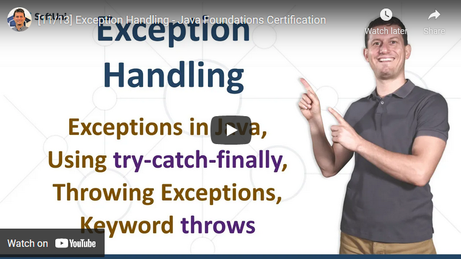

<h1 align="center">18. Exception Handling</h1>

#### 1. Lesson Summary

In the current lesson, we take a close look at <b>exception handling </b>and<b> why it's important</b> in software engineering.

What are exceptions? We've all seen one, there is no way to write completely bug-free code. In short<b> an exception is</b> <b>a problem that arises during the execution of the program</b>.

Exceptions <b>simplify code construction</b> and maintenance and allow problematic situations to be <b>processed at multiple levels</b>.

In Java <b>exceptions are objects</b>. The base for all exceptions is the <b>Throwable class</b> - it contains information about the <b>cause </b>of the exception, its <b>description</b>, and the <b>stack trace</b>.

There are<b> two types of exceptions</b> - <b>checked </b>(also known as compile-time exceptions), and <b>unchecked </b>(also known as runtime exceptions).

Exceptions can be handled by the <b>try-catch</b> construction. The <b>try-finally </b>block is also used, especially when we want to <b>ensure the execution of a given block</b> of code.

To <b>raise an exception</b>, we use the <b>throw </b>keyword. When an exception is thrown <b>the program execution stops</b>, and the<b> execution travels over the stack</b> until <b>a matching catch block </b>is reached to handle it.

#### 2. Table of Contents
* [1. Lesson Summary](#1-Lesson-Summary)
* [2. Table of Content](#2-Table-of-Content)
* [3. YouTube Video](#3-YouTube-Video)
* [4. Lesson Topics](#4-Lesson-Topics)
* [5. Resources](#5-Resources)
* [6. Practical Exercises](#6-Practical-Exercises)
* [7. Navigation](#7-Navigation)

#### 3. Lesson Video

    

#### 4. Lesson Topics
In this lesson we cover the following topics:
* What are Exceptions?
    * The Exception class 
    * Types of exceptions and their hierarchy
* Handling Exceptions
* Raising (throwing) Exceptions
* Best Practices
*  Creating Custom Exceptions
* Coding Exercises

#### 5. Resources

Remember that coding is a skill, which should be practiced. To learn to code, you should write code every day for a long time. Watching tutorials is not enough. You should code! 

| Resources | Link |
| ----- | ----- |
| Lesson Video| [YouTube](https://youtu.be/b6G85jwBdDM) |
| Lesson Content | [SoftUni](https://softuni.org/code-lessons/java-foundations-certification-exception-handling/) |

#### 6. Practical Exercises
<a href="https://softuni.org/checkout/join-community">Register</a> now and take your free resources right away! You will get access to **automated exercises** which will sharpen your coding skills. Become a member of the SoftUni Global Community and communicate with other students and mentors and get help for **FREE**.
Please watch the video and solve the exercise problems. Writing code is the only way to master the skill of coding. Submit your code at the SoftUni Judge.

| Resources | Link |
| ----- | ----- |
| Problem Descriptions | [Available after Free Registration](https://softuni.org/code-lessons/java-foundations-certification-exception-handling/) |
| Submit Solutions for Evaluation | [Available after Free Registration](https://softuni.org/code-lessons/java-foundations-certification-exception-handling/) |

#### 7. Navigation

    <a href="https://github.com/SoftUni/Free-Java-Certification-Course/blob/main/lessons/17-OOP-Principles.md">« Previous Lesson</a> &nbsp; | &nbsp; <a href="https://github.com/SoftUni/Free-Java-Certification-Course">Home</a> &nbsp; | &nbsp; <a href="https://github.com/SoftUni/Free-Java-Certification-Course/blob/main/lessons/19-API-Classes.md">Next Lesson »</a>

