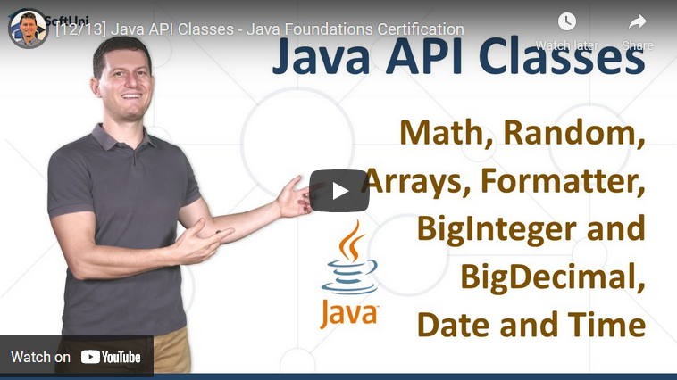

<h1 align="center">19. API Classes</h1>

#### 1. Lesson Summary

In the current lesson, we take a closer look at the most frequently used <b>Java API classes</b>. Svetlin Nakov will explain all about the Math class, how to generate random numbers, the need of <b>BigInteger </b>and <b>BigDecimal </b>in programming, and how to work with date and time in <b>Java</b>. We will also look at two of the main <b>Java classes</b> - <b>Arrays </b>and <b>Formatter</b>.

The <b>Math </b>class contains methods for performing basic numeric operations, such as <b>round, min, max, abs, ceil, etc</b>.. The <b>Arrays </b>class contains various methods which facilitate array manipulation. <b>String.format()</b> allows us to return the formatted string by given <b>locale</b>, <b>format</b>, and <b>arguments</b>.

In this lesson you will find many helpful <b>examples </b>and <b>exercises</b>, so make sure to <b>practice </b>what you've learned! That's the only way to grasp the concept at hand.

<b>BigInteger </b>and <b>BigDecimal </b>are used for handling <b>large </b>and <b>small numbers</b> with <b>great</b> <b>precision</b>. <b>BigInteger </b>will throw an exception when the result is <b>out of range</b>. <b>BigDecimal </b>gives the user <b>complete control </b>over the rounding behavior. Importing a single package allows us to work with the <b>date </b>and <b>time API</b>. 

#### 2. Table of Contents
* [1. Lesson Summary](#1-Lesson-Summary)
* [2. Table of Content](#2-Table-of-Content)
* [3. YouTube Video](#3-YouTube-Video)
* [4. Lesson Topics](#4-Lesson-Topics)
* [5. Resources](#5-Resources)
* [6. Practical Exercises](#6-Practical-Exercises)
* [7. Navigation](#7-Navigation)

#### 3. Lesson Video

#### 4. Lesson Topics
In this lesson we cover the following topics:

* The Judge System
    * The Exception class
    * Types of exceptions and their hierarchy
* The Math Class
* The Random Class
*  The Arrays Class
    * Methods of the Arrays Class
    * Example of Sorting an Array
* String Formatter
* BigInteger and BigDecimal
* Coding Exercises

#### 5. Resources

Remember that coding is a skill, which should be practiced. To learn to code, you should write code every day for a long time. Watching tutorials is not enough. You should code! 

| Resources | Link |
| ----- | ----- |
| Lesson Video| [YouTube](https://youtu.be/H57pSYrPv-g) |
| Lesson Content | [SoftUni](https://softuni.org/code-lessons/java-foundations-certification-java-api-classes/) |

#### 6. Practical Exercises
You will get access to **automated exercises** which will sharpen your coding skills. Become a member of the SoftUni Global Community and communicate with other students and mentors and get help for **FREE**.
Please watch the video and solve the exercise problems. Writing code is the only way to master the skill of coding. Submit your code at the SoftUni Judge.

| Resources | Link |
| ----- | ----- |
| Problem Descriptions | [Access the Learning Materials](https://softuni.org/code-lessons/java-foundations-certification-java-api-classes/) |
| Submit Solutions for Evaluation | [Access the Learning Materials](https://softuni.org/code-lessons/java-foundations-certification-java-api-classes/) |

#### 7. Navigation

    <a href="https://github.com/SoftUni/Free-Java-Certification-Course/blob/main/lessons/18-Exception-Handling.md">« Previous Lesson</a> &nbsp; | &nbsp; <a href="https://github.com/SoftUni/Free-Java-Certification-Course">Home</a> &nbsp; | &nbsp; <a href="https://github.com/SoftUni/Free-Java-Certification-Course/blob/main/lessons/20-JDK-and-JRE.md">Next Lesson »</a>

