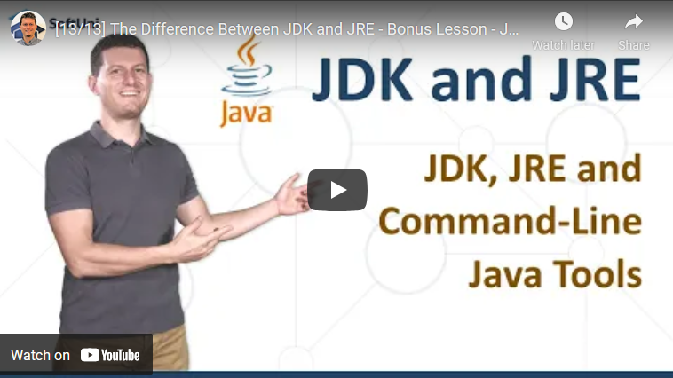

<h1 align="center">20. JDK and JRE</h1>

#### 1. Lesson Summary

We cannot start explaining the difference between <strong>JRE</strong> and <strong>JDK</strong> without also explaining <strong>JVM</strong>. <strong>JVM</strong> or <strong>Java Virtual Machine</strong> simply helps to execute programs on our devices. It provides an environment to run the programs. <strong>JVM</strong> requires libraries and files for code execution, and these files are presented in <strong>JRE</strong>. We can have different <strong>JRE</strong> versions for different platforms. They are all platform-dependent.

<strong>JRE = set of libraries + JVM</strong>

<strong>JDK</strong> or <strong>Java Development Kit</strong> is a full-featured development kit. It has all development tool that we might require for creating java programs.

<strong>JDK</strong> contains the following tools:
<ol>
 	<li><strong>Java Runtime Environment</strong> (<strong>JRE</strong>)</li>
 	<li><strong>Interpreter</strong></li>
 	<li><strong>Compiler</strong> (javac)</li>
 	<li><strong>Archiver</strong> (jar)</li>
 	<li><strong>Documentation generator</strong> (javadoc)</li>
</ol>

If you want to run your program you will need to use <strong >java</strong> or <strong >javac </strong>commands. The <strong >javac </strong>command is used to compile Java programs, it takes <strong>.java</strong> file as input and produces bytecode. On the other hand, the <strong >java command</strong> is used to execute the bytecode of java. It takes byte code as input and runs it and produces the output.

In conclusion, if you want to run the java or <strong>JVM</strong>-based code, then <strong>JRE</strong> is required. But if you want to develop <strong>Java</strong> and <strong>JVM</strong>-based programs, then <strong>JDK</strong> is required. Depending on your needs you will use <strong>javac</strong> and <strong>java </strong>commands.

#### 2. Table of Contents
* [1. Lesson Summary](#1-Lesson-Summary)
* [2. Table of Content](#2-Table-of-Content)
* [3. YouTube Video](#3-YouTube-Video)
* [4. Lesson Topics](#4-Lesson-Topics)
* [5. Resources](#5-Resources)
* [6. Navigation](#6-Navigation)

#### 3. Lesson Video

#### 4. Lesson Topics
In this lesson we cover the following topics:
* What is Java?
* JDK and JRE 
* Java and Javac

#### 5. Resources

Remember that coding is a skill, which should be practiced. To learn to code, you should write code every day for a long time. Watching tutorials is not enough. You should code! 

| Resources | Link |
| ----- | ----- |
| Lesson Video| [YouTube](https://youtu.be/szBvTLtj6oA) |
| Lesson Content | [SoftUni](https://softuni.org/code-lessons/java-foundations-certification-java-jdk-and-jre/) |

#### 6. Navigation

    <a href="https://github.com/SoftUni/Free-Java-Certification-Course/blob/main/lessons/19-API-Classes.md">« Previous Lesson</a> &nbsp; | &nbsp; <a href="https://github.com/SoftUni/Free-Java-Certification-Course">Home</a> &nbsp; | &nbsp; Next Lesson »

